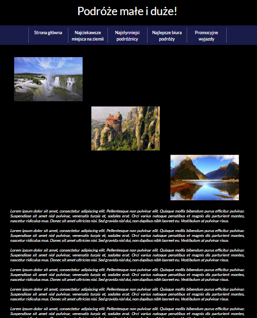

# Travels
A website about the best palces and travelers in the world, written in HTML, CSS and JavaScript.
## Target of project 
 It is a website, where you will find information about the best places in the world, travelers and travel agencies. 
## Technologies
1. HTML - creating a website structure, which includes: logo, menu, small galery, content and footer
2. CSS - describing the style of website
3. JavaScript - sticky menu and scroll button.

   

